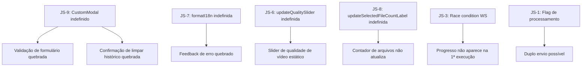

# Segunda Análise Técnica — Pontos Não Cobertos no Relatório 1

## Contexto

Este é o segundo relatório de análise técnica do Pixel Forge, complementar ao `spec:6b473164-2a8f-407d-88a0-5efd8d2d7545/e5dd1593-6189-405d-aba3-6bd8b496e183`. Foca exclusivamente em pontos **não cobertos** na primeira análise, após leitura completa do JavaScript do frontend, scripts de bootstrap e documentação.

---

## 1. Bugs Funcionais no JavaScript (Frontend)

### JS-1 🔴 Alta — `handleProcess` não desabilita o botão durante processamento de vídeo com upload grande

**Arquivo:** `file:static/index.html` (linha ~2946)

O botão de submit é desabilitado (`btn.disabled = true`) antes do `fetch`, mas o `finally` sempre o reabilita — **inclusive se o servidor ainda estiver processando o vídeo**. Como o endpoint `/process-video` é síncrono (aguarda o FFmpeg terminar), o `fetch` só retorna quando o processamento termina. Porém, se o usuário clicar novamente antes da resposta chegar (ex: conexão lenta), o botão pode ser reabilitado prematuramente por um timeout ou erro de rede, permitindo duplo envio.

**Impacto:** Duplo processamento do mesmo arquivo, consumo duplicado de CPU/disco.

**Correção:** Usar uma flag de estado global por tipo (`isProcessing.images`, `isProcessing.videos`) que persiste além do `finally`, sendo limpa apenas após a resposta completa do servidor.

---

### JS-2 🔴 Alta — `clientId` gerado com `Math.random().toString(36).substr(2)` — `substr` está depreciado

**Arquivo:** `file:static/index.html` (linha 2316)

```js
const clientId = Date.now().toString(36) + Math.random().toString(36).substr(2);
```

`String.prototype.substr` foi **removido do padrão ECMAScript** e está depreciado em todos os browsers modernos. O correto é `substring(2)` ou `slice(2)`.

**Impacto:** Warnings no console em browsers modernos; pode quebrar em ambientes futuros.

---

### JS-3 🔴 Alta — Race condition no WebSocket: `clientId` enviado no FormData antes do WS estar conectado

**Arquivo:** `file:static/index.html` (linhas 1979, 2316–2434)

O `clientId` é incluído no `FormData` enviado ao backend para receber progresso via WebSocket. Porém, `connectWebSocket()` é chamado no `init` e a conexão é assíncrona. Se o usuário processar um arquivo imediatamente após abrir a página (antes do WS conectar), o backend tentará enviar mensagens para um `client_id` que ainda não está registrado no `ConnectionManager`, e as mensagens de progresso serão silenciosamente descartadas.

**Impacto:** Barra de progresso não atualiza na primeira execução logo após abrir o app.

**Correção:** Aguardar o evento `ws.onopen` antes de habilitar o botão de processamento, ou verificar `ws.readyState === WebSocket.OPEN` antes de incluir o `client_id` no FormData.

---

### JS-4 🟡 Média — `sentinel_error` key no i18n usa formato inconsistente

**Arquivo:** `file:static/index.html` (linha ~2407)

```js
const msg = (translations[currentLang].sentinel_error || 'Erro (Sentinela)') + ': ' + data.file;
```

A chave `sentinel_error` é usada diretamente como string de prefixo, mas nos testes (`test_i18n.py`) ela é verificada como `sentinel_error:` (com dois-pontos). Isso indica que a chave foi projetada para conter o texto completo incluindo o sufixo, mas o JS concatena manualmente. Se a tradução mudar o formato, a mensagem ficará duplicada ou malformada.

---

### JS-5 🟡 Média — `applyImagePreset` acessa `form.target_format` diretamente sem verificar existência

**Arquivo:** `file:static/index.html` (linha ~1758)

```js
if (preset.format) form.target_format.value = preset.format;
```

`form.target_format` é um acesso via `HTMLFormElement` named element lookup. Se o `<select name="target_format">` não existir ou tiver o nome errado, isso lança `TypeError: Cannot set properties of undefined`. Não há guard de null-check.

---

### JS-6 🟡 Média — `updateQualitySlider` referenciada mas nunca definida no código lido

**Arquivo:** `file:static/index.html` (linhas 361, 2440–2443)

O slider de qualidade de vídeos usa `oninput="updateQualitySlider(this, 'quality-val-videos')"` e o init chama `updateQualitySlider(slider, valueId)`, mas a função `updateQualitySlider` não aparece definida no código JavaScript analisado. Se ela não existir, o slider de qualidade de vídeos não atualizará o display de porcentagem.

**Impacto:** O valor exibido ao lado do slider de qualidade de vídeos fica estático em "80%" independente do que o usuário arrasta.

---

### JS-7 🟡 Média — `formatI18n` referenciada mas nunca definida no código lido

**Arquivo:** `file:static/index.html` (linha ~2151)

```js
const summary = formatI18n('processing_finished_with_errors', { count: processedCount }, `Concluído com erros (${processedCount}).`);
```

A função `formatI18n` é chamada para interpolação de strings i18n, mas não foi encontrada definida no código JavaScript analisado. Se não existir, lança `ReferenceError` quando há erros de processamento, quebrando o bloco `catch` e deixando o usuário sem feedback de erro.

---

### JS-8 🟡 Média — `updateSelectedFileCountLabel` referenciada mas nunca definida no código lido

**Arquivo:** `file:static/index.html` (linha ~1641)

```js
fileInput.addEventListener('change', function() {
    updateSelectedFileCountLabel(type);
});
```

A função `updateSelectedFileCountLabel` é chamada quando o usuário seleciona arquivos, mas não foi encontrada definida. Se não existir, o contador de arquivos selecionados nunca é atualizado, deixando o usuário sem feedback visual de quantos arquivos foram selecionados.

---

### JS-9 🟡 Média — `CustomModal` referenciado mas nunca definido no código lido

**Arquivo:** `file:static/index.html` (linhas ~1487, ~1677, ~1984, ~1994, ~2001)

`CustomModal.confirm(...)` e `CustomModal.alert(...)` são chamados em múltiplos lugares críticos (limpar histórico, validação de formulário), mas a definição do objeto `CustomModal` não foi encontrada no código JavaScript analisado. Se não existir, todas essas chamadas lançam `ReferenceError`, quebrando completamente o fluxo de confirmação e validação.

**Impacto:** Crítico — o botão "Processar" pode não funcionar se a validação de formulário depende de `CustomModal.alert`.

---

## 2. Problemas de Segurança Adicionais

### SEC-A 🟡 Média — `SECURITY.md` não informa canal de contato para reporte de vulnerabilidades

**Arquivo:** `file:SECURITY.md`

O documento descreve o que incluir no reporte, mas **não fornece o canal** (e-mail, GitHub Security Advisory, formulário) para onde enviar. Isso torna o processo de divulgação responsável inoperante — pesquisadores de segurança não saberão como contatar a equipe.

**Correção:** Adicionar endereço de e-mail de segurança (ex: `security@informigados.com.br`) ou link para GitHub Security Advisories.

---

### SEC-B 🟡 Média — `run.bat` instala dependências de produção + teste sem distinção

**Arquivo:** `file:run.bat` (linha 49)

```bat
"%PYTHON_EXE%" -m pip install -r requirements.txt
```

Como `pytest` e `httpx` estão no `requirements.txt` principal (problema C7 do relatório 1), o `run.bat` instala ferramentas de teste no ambiente de produção do usuário final. Isso aumenta a superfície de ataque e o tamanho do ambiente desnecessariamente.

---

### SEC-C 🟢 Baixa — `setup_ffmpeg.py` baixa arquivos para o diretório de trabalho atual

**Arquivo:** `file:setup_ffmpeg.py` (linhas 82–83)

```python
archive = Path("ffmpeg-win.zip")
_download_file("...", archive)
```

O arquivo temporário é criado no **diretório de trabalho atual** (não em `tempfile.mkdtemp()`). Se o usuário executar `setup_ffmpeg.py` de um diretório diferente do root do projeto, o arquivo pode ser criado em local inesperado. Além disso, se o processo for interrompido antes do `finally`, o arquivo temporário pode ficar no diretório de trabalho do usuário.

---

## 3. Problemas de UX e Interface Adicionais

### UX-A 🟡 Média — Imagens de autores (`images/authors/`) não existem no repositório

**Arquivo:** `file:static/index.html` (linhas 581, 588)

```html


```

O diretório `static/images/authors/` não existe no repositório (apenas `static/images/` vazio). As imagens sempre falham e mostram o SVG de fallback (silhueta genérica). Embora o fallback funcione, a aba "Sobre" nunca mostra as fotos reais dos autores.

**Correção:** Adicionar as imagens ao repositório em `static/images/authors/`, ou usar URLs externas (GitHub avatars) com `crossorigin="anonymous"`.

---

### UX-B 🟡 Média — Aba "Sobre" tem textos hardcoded em português que não são traduzidos

**Arquivo:** `file:static/index.html` (linhas 527–535, 541–555, 560–566)

Vários textos na aba "Sobre" não têm `data-i18n` e estão hardcoded em português:
- `"Sobre o Pixel Forge"` (linha 527)
- `"Versão 1.0.0"` (linha 529)
- `"O Pixel Forge é uma ferramenta..."` (parágrafo completo, linha 531)
- `"Presets Inteligentes"`, `"Modo Sentinela"`, `"Alta Performance"`, `"Privacidade"` (cards de features)
- `"Tecnologias & Créditos"` (linha 560)
- `"Autores"` (linha 578)
- `"Desenvolvido com ❤️ pela equipe INformigados"` (linha 570)
- `"Acessar Repositório"` (linha 573)

Isso quebra a experiência multilíngue para usuários em EN/ES/PT-PT.

---

### UX-C 🟡 Média — `CONTRIBUTING.md` não menciona `requirements-dev.txt` (que ainda não existe)

**Arquivo:** `file:CONTRIBUTING.md`

O guia de contribuição instrui `pip install -r requirements.txt` para setup de desenvolvimento, mas após a correção C7 (separação de deps), o correto será `pip install -r requirements.txt -r requirements-dev.txt`. O documento precisará ser atualizado junto com a criação do `requirements-dev.txt`.

---

### UX-D 🟢 Baixa — `run.bat` e `run.sh` verificam FFmpeg com lógica diferente de `start.py`

**Arquivos:** `file:run.bat` (linha 60), `file:run.sh` (linha 55), `file:start.py` (linhas 43–74)

Os scripts de bootstrap verificam FFmpeg com um one-liner Python inline. O `start.py` tem a função `ensure_ffmpeg_available()` com a mesma lógica, mas duplicada. Se a lógica de detecção mudar em `start.py`, os scripts de bootstrap ficam desatualizados. Deveriam chamar `start.py --check-ffmpeg` ou importar a função diretamente.

---

### UX-E 🟢 Baixa — `run.bat` não verifica versão mínima do Python

**Arquivo:** `file:run.bat`

O script verifica se `python` existe no PATH, mas não verifica se é Python 3.10+. Um usuário com Python 2.7 ou 3.8 no PATH receberá erros crípticos de importação em vez de uma mensagem clara.

**Correção:** Adicionar verificação de versão: `python -c "import sys; sys.exit(0 if sys.version_info >= (3,10) else 1)"`.

---

## 4. Resumo Consolidado dos Dois Relatórios

| Categoria | Relatório 1 | Relatório 2 | Total |
|-----------|------------|------------|-------|
| 🔴 Alta | 3 | 3 | **6** |
| 🟡 Média | 12 | 10 | **22** |
| 🟢 Baixa | 8 | 4 | **12** |
| **Total** | **23** | **17** | **40** |

---

## 5. Mapa de Dependências dos Problemas JS



> **Nota importante:** Os problemas JS-6, JS-7, JS-8 e JS-9 podem ser funções definidas em partes do arquivo que não foram lidas (o arquivo tem 2449 linhas e foi lido em blocos). Antes de implementar correções, confirmar se essas funções existem em alguma parte do arquivo. Se existirem, os problemas são apenas de organização; se não existirem, são bugs críticos.

---

## 6. Plano de Correção Adicional

Os novos problemas foram agrupados em **2 tickets adicionais**:

- **Ticket 5** — Correção de bugs JavaScript e funções ausentes/depreciadas
- **Ticket 6** — UX: textos não traduzidos na aba Sobre, imagens de autores, documentação e scripts de bootstrap